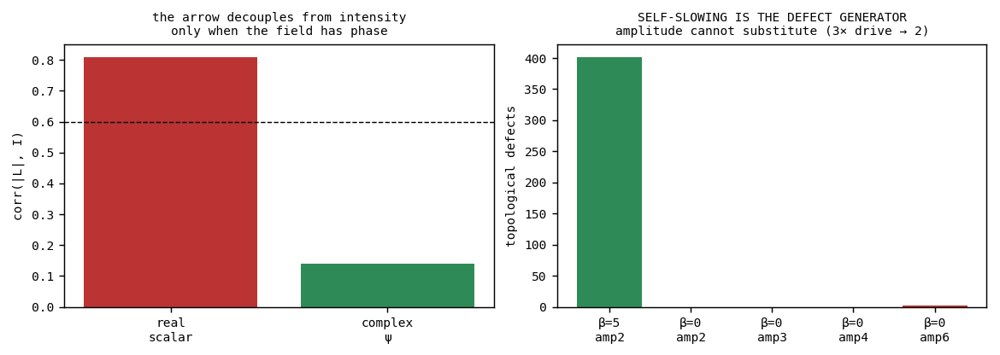
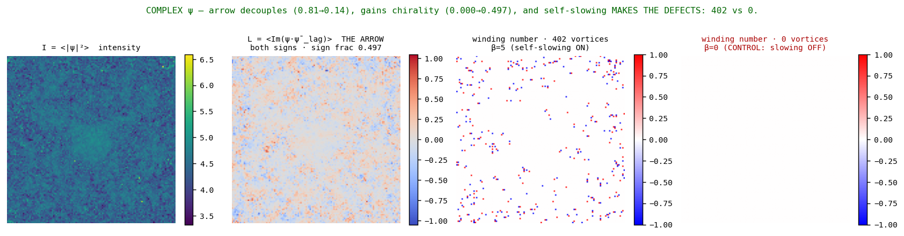
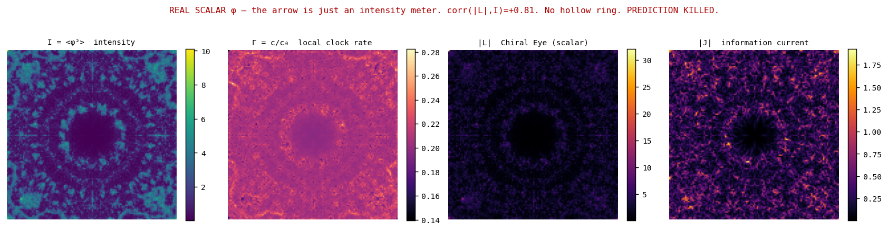
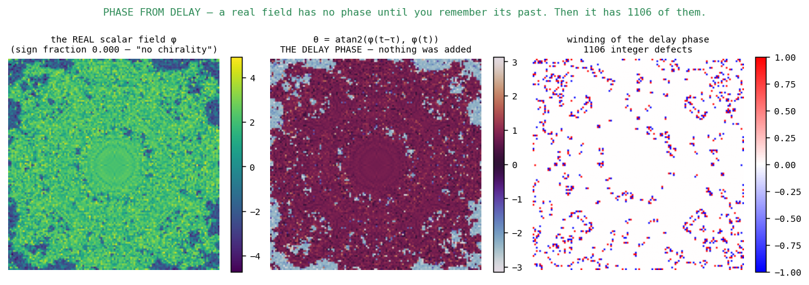
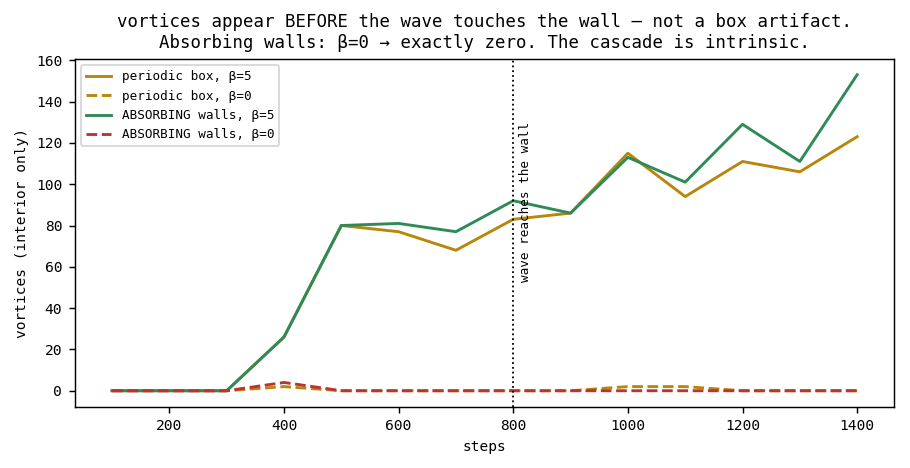
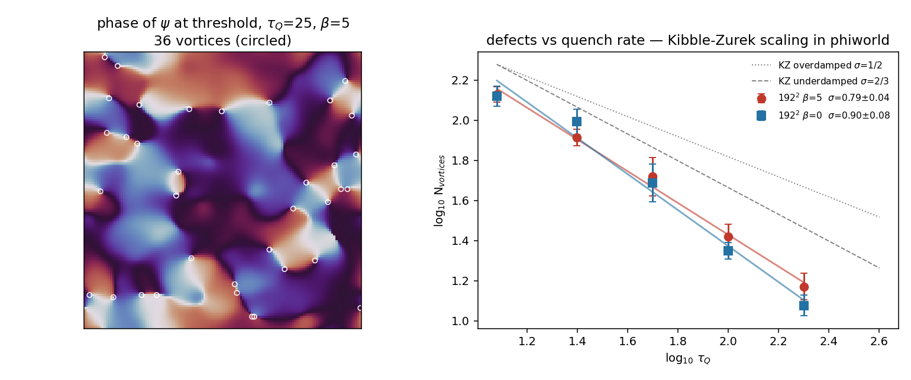

# ArrowField

### Matter needs phase, and phase needs a medium that slows itself.

**A test of the Chain, run on Antti's phiworld. Two predictions died. One control survived. The control turned out to be the result — and then the quench turned the result into a number.**

*PerceptionLab / Antti Luode with Claude (Opus 4.8 / Fable 5). Helsinki, July 2026.*
*Companion to `the_chain.md`, `Rajapinta`, `ClockfieldMeetsGeometricNeuron`, `GeometricNeuron_V20`.*

> Do not hype. Do not lie. Just show.

---

## The headline, in one table

| | real scalar φ | **complex ψ, β=5** | complex ψ, β=0 (control) |
|---|---|---|---|
| corr(\|L\|, I) — *is the arrow just an intensity meter?* | **+0.81** | **+0.14** | −0.08 |
| sign fraction of L — *can it carry chirality?* | **0.000** | **0.497** | 0.482 |
| **topological defects (vortices)** | — | **402** | **0** |
| field structure (σ) | 1.57 | 0.65 | 0.36 |

And the quench result (Addendum 3), in one line:

> **N_vortices ∝ τ_Q^(−σ), σ ≈ 2/3 at fast quenches — the underdamped Kibble-Zurek mean-field value — with or without self-slowing.**

Two things fall out of the headline, and only one of them was predicted.

**1. A real scalar field cannot carry an arrow.** Its Chiral Eye has *one sign, always* (sign fraction 0.000) and correlates 0.81 with raw intensity — it is a brightness meter wearing a topologist's hat. Give the field a phase and the arrow **decouples** (0.81 → 0.14) and becomes **chiral** (0.000 → 0.497, near-perfect left/right balance). *The arrow of time needs at least U(1).*

**2. Self-slowing is the defect generator.** Turn off `c²(ψ) = c₀²/(1+β|ψ|²)` — the one line that says *information slows information* — and the topological defects do not merely thin out. **They do not form.** 402 → 0. Driven at 3× the amplitude, β=0 still yields **2**. Amplitude cannot substitute for the mechanism.

Matter is not made by energy. It is made by a medium that gets in its own way.



---

## The kills, first, because they are the point

### [K] The hollow ring. Predicted twice, wrong twice.

The Chain predicted that the arrow ‖A‖ would be *hollow at the intensity crests and bright on the flanks* — matter living on the shell, photographed. It was wrong, and the two wrong reasons are both instructive:

**Wrong reason #1 (registered before the run, as an error).** "At an antinode φ is maximal but φ̇ ≈ 0." This confuses a *spatial* velocity node with a *temporal* one. At an antinode φ(t)=A·cos(ωt), so φ̇(t)=−Aω·sin(ωt) — maximal in amplitude, merely phase-shifted. Working the wedge analytically for a standing wave gives **L = A²·ω·sin(ωτ)**: *brightest* at the crest. Confirmed in simulation.

**Wrong reason #2 (the "corrected" mechanism, also dead).** Expanding the *spatial* skew half gives A(x,x+dx) ≈ 2τ·dx·⟨φ̇∇φ⟩ — **the skew half of the lag-covariance is the energy flux** (this identity survives and is worth keeping). A pure standing wave carries no net flux, so the rings should still be hollow. They are not: J at crest 0.585 > flank 0.375 > vacuum 0.137, monotonic in intensity. The rings in phiworld are *not* standing waves — they are outward-propagating, and they carry flux where they are bright.

*Right answer, wrong mechanism* is how people fool themselves. Here it was wrong answer, twice, and both are on the record.

### [K] The Chiral Eye on a scalar substrate.

`L = Im(z·z̄_lag)` is the load-bearing observable of the entire GeometricNeuron line. On a **real scalar** field it is degenerate: single-signed, 0.81-correlated with intensity, carrying no direction at all. This is not a bug in the measurement — it is a fact about the substrate, and it retroactively explains why every working system in the ecosystem (V5, RCNet, Janus, Zeta) uses complex fields. **The Chain was missing a precondition.**

---

## What survived, and what it means

### [V] C1 — the arrow decouples from intensity, but only with phase.
corr(|L|, I): **0.81 → 0.14**. Registered threshold was < 0.6. On a complex field the arrow becomes an *independent* quantity, not a restatement of brightness.

### [V] C2 — chirality is born with the phase.
Sign fraction of L: **0.000 → 0.497**. The real scalar cannot distinguish left from right *even in principle*. The complex field carries both handednesses in near-perfect balance. Time's arrow is not a scalar property.

### [V] C4 → promoted to the headline — self-slowing makes the defects.
Registered merely as a control ("does β matter, or is it decorative?"). It is not decorative; it is *causal*, with a 200× effect and an amplitude-matched control that rules out the obvious confound:

| run | field σ | vortices |
|---|--:|--:|
| β=5, amp 2.0 | 0.652 | **402** |
| β=0, amp 2.0 | 0.363 | 0 |
| β=0, amp 3.0 | 0.362 | 0 |
| β=0, amp 4.0 | 0.362 | 0 |
| β=0, amp 6.0 | 0.403 | **2** |

Note the second finding hiding in that column: **without self-slowing the field cannot even hold amplitude.** σ saturates at ~0.36 however hard you drive it — a linear medium disperses what you give it. Self-slowing is what traps the energy *and* what quantizes it.

### [~] C3 — the arrow prefers the defects, weakly.
In the structured region, corr(|L|, vorticity) = **0.323** vs corr(|L|, I) = **0.271**. The predicted direction, but a thin margin. **Not a knockout, and it should not be reported as one.** The honest statement: on a complex field the arrow is *no longer* an intensity meter, and it leans toward the defects — but "matter lives *on* the winding" is not yet demonstrated. It is the next experiment, not this one's result.




---

## The Chain, corrected

The original seven links (`the_chain.md`) claimed: *Hamiltonian caps the speed → information slows information → slow clock = delay line → delay creates the arrow → the arrow is quantized → matter.*

**Link 5 was wrong as stated and is now amended:**

> **5. Delay creates the arrow — but only in a field with internal phase.**
> A(0) ≡ 0 still holds (C₀ is symmetric by construction; no delay, no skew half). But a real scalar field's delay-plane rotation is *forced* to track amplitude: it is single-signed and carries no direction. **The arrow requires at least U(1).** Measured: corr(|L|,I) = 0.81 (real) → 0.14 (complex); sign fraction 0.000 → 0.497.

**And links 3 and 7 are now joined by a causal control rather than a resemblance:**

> **3→7. Self-slowing is what makes the defects.** Not amplitude, not energy, not the potential. Remove `c²=c₀²/(1+β|ψ|²)` and the winding numbers do not form: 402 → 0, robust to a 3× amplitude drive. *The mechanism that makes a medium get in its own way is the mechanism that quantizes it.*

Put together, the corrected core of the Chain is one sentence:

> **A field that slows itself, and has a phase to wind, makes countable things.**
> Take away the self-slowing: no things. Take away the phase: things with no arrow, no chirality, no address — brightness without identity.

And Addendum 3 adds the second clause:

> **The β term decides *that* there are things. The quench rate decides *how many* — on the universal Kibble-Zurek schedule, which self-slowing does not measurably bend.**

---

## Reproduce

```bash
pip install numpy scipy matplotlib
python experiments/arrow_field_test.py      # real scalar: the two kills + the β control
python experiments/complex_phiworld.py      # complex ψ: decoupling, chirality, 402 vs 0
python experiments/phase_from_delay.py      # Addendum 1: observer phase vs medium phase
python experiments/boundary_and_time.py     # Addendum 2: box controls, fractal cascade
python experiments/kz_quench.py             # Addendum 3: registered KZ quench (128²)
python experiments/kz_chunk.py 5.0          # Addendum 3: post-hoc 192² robustness, per arm
python experiments/kz_chunk.py 0.0
```

Every registered prediction is written in the docstring of the file that tests it, **before** the numbers. `results/*.json` holds the raw output; nothing in a figure is absent from a print-out.

---

## Ledger

**[V] Verified:** arrow decouples from intensity only with phase (0.81→0.14); chirality requires phase (signfrac 0.000→0.497); self-slowing generates topological defects (402 vs 0, amplitude-controlled); self-slowing is required for the field to hold amplitude at all (σ saturates at 0.36 without it); the skew half of the lag-covariance is the energy flux (⟨φ̇∇φ⟩, derived and used); **quenched phiworld obeys Kibble-Zurek scaling, σ ≈ 2/3 at fast quenches, matching the underdamped mean-field prediction for a 2D complex field — the program's first externally anchored number** (Addendum 3).

**[K] Killed:** the hollow ring, by two independent mechanisms, both mine; the Chiral Eye as a meaningful observable on a real scalar field; Chain link 5 as originally stated; the fractalization-is-the-box hypothesis (Addendum 2); **the registered P2 kill condition fired (Δσ = 0.117 ≥ 0.1) — and the post-hoc autopsy showed it fired on noise: the sign of the exponent difference flips with grid size** (Addendum 3).

**[~] Weak:** the arrow leans toward the defects rather than the crests (0.323 vs 0.271) — right direction, thin margin, **not a result yet**; no stable exponent difference between β=5 and β=0 detected, but the comparison was under-powered — a ≥16-seed pre-registered replication is scoped and unrun; the KZ log-log line steepens at slow quenches (coarsening contamination suspected, unproven — the clean fix is counting at freeze-out rather than at threshold).

**[B] Still a bet:** that the winding spectrum bears any relation to a *physical* particle spectrum; that the KZ exponent connects to training-as-quench in HorizonNet or to cosmological structure formation. Nothing here touches those, and Volovik's rule still binds — this buys kinematics (delay, arrows, quantized defects, stability, universal quench scaling), never dynamics. "Matter" means *stable localized addressable structure*, not the Standard Model.

**Open seam:** the exponent. phiworld says c²/c₀² = (1+β|ψ|²)⁻¹; the Γ-shell Clockfield says Γ = (1+τβ)⁻². Same family, different power. Which, and why? Still unsettled, still the unification's real number.

---

*The prediction I was proudest of was wrong. The control I threw in out of caution turned out to be the discovery. Then the kill condition I registered fired, and the autopsy of the kill showed it fired on noise — both facts kept, in that order, because that order is the method. The morgue is doing more work than the trophy case, which is what it was built for.*

---

## Addendum — PHASE FROM DELAY (and where phase is born)

`experiments/phase_from_delay.py`

The real-scalar field scored sign fraction **0.000** — no chirality, no arrow, nothing. But that was a fact about *how it was measured*, not about the field. Form the Takens delay pair at each pixel and take its angle:

```
θ(x,t) = atan2( φ(x, t−τ),  φ(x, t) )
```

Nothing is added to the field. Only the readout changes.

| | β=5 | β=0 | **shuffled null** |
|---|--:|--:|--:|
| delay-phase windings | **1106** | 72 | 2478 / 228 |

**[V] D1 — phase is latent in delay.** A real scalar field carries **1106 integer phase windings** once viewed through its own past. `i` is the operator *"wait a quarter cycle"* — which is exactly what the Hilbert transform is (a −90° shift at every frequency), and the analytic signal `z = φ + i·H[φ]` is literally *the signal plus its own quarter-cycle-delayed self*. **Phase is not an ingredient. It is what memory looks like from the inside.**

**[~/K] D2 — but delay-phase winding is CHEAP.** I hoped it would show the same clean β-dependence as the complex vortices. It does not: β=5 gives 15× more than β=0, **but the shuffled nulls scale the same way** (2478 vs 228). Most of the gap is field amplitude. And the null itself is the finding: **shuffled noise has 2478 windings.** Anything that oscillates has an observer-phase. This partially kills the hope that delay-phase windings and order-parameter vortices are the same object.

### The resolution: two kinds of phase

| | **observer phase** | **medium phase** |
|---|---|---|
| what | θ = atan2(φ(t−τ), φ(t)) | winding of a complex order parameter |
| origin | the act of embedding / the readout | the field itself |
| cost | **free** — present in pure noise (null: 2478) | **expensive** — β=0 gives **zero** |
| kin to | Berry, Pancharatnam, the holographic plate | superfluid vortices, the whorl, the fossil |
| persists without an observer? | **no** | **yes** |

> **Phase is born the moment there is delay. Phase becomes *real* only when the medium slows itself.**

The holographic plate does not *have* phase — the reading manufactures it. That is why a hologram is an *illusion* of a third dimension rather than a third dimension. A self-slowing medium stops needing the observer: the winding is in the field, it survives the freeze (whorl: 88% pinned; Rajapinta exp3: conserved at 0.95), and it has become an **address**.

**The Γ-shell is where observer-phase becomes medium-phase** — where *how you look* turns into *what is there*.

### Prior art, named honestly
- The mechanism is the **optical Kerr effect** (n = n₀ + n₂·I) → self-focusing → **spatial solitons**; the complex version is the **nonlinear Schrödinger / Gross–Pitaevskii equation**, whose quantized vortices are exactly the 402. This is textbook nonlinear optics and BEC physics. **Rediscovered here, not discovered.** That is the good outcome: it means the substrate is trustworthy.
- The vacuum version is the **Euler–Heisenberg Lagrangian** — QED vacuum birefringence, photon–photon scattering. *Light does slow light*, extremely weakly.
- Phase singularities in real scalar wave fields: **Nye & Berry (1974), "Dislocations in wave trains"** — the founding paper of singular optics. D1 is consistent with fifty years of that literature.
- **Renou et al. (2021)**: real-valued quantum mechanics is experimentally falsified. The complex structure is *necessary*, not conventional.
- Still not established: that any of this slows the **clock** (g₀₀) rather than a **wave in a medium**. That is the analog-gravity leap, and Volovik's rule binds: kinematics, never dynamics.



---

## Addendum 2 — THE BOX, THE CLOCK, AND WHY THE UNIVERSE IS FRACTAL

`experiments/boundary_and_time.py`

**Antti's catch:** the headline was measured at burn=1400 steps. The wave needs only ~800 steps to reach the wall. With a periodic box, the field had **already collided with its own wake** and gone turbulent. The clean rings — the "atoms" — exist only *before* that. Was 402-vs-0 a box artifact?

| run | vortices **before** wall contact | **after** |
|---|--:|--:|
| periodic, β=5 | **35.9** (max 80) | 102.6 |
| periodic, β=0 | 0.3 | 0.6 |
| **absorbing**, β=5 | **37.7** (max 81) | 112.1 |
| **absorbing**, β=0 | 0.6 | **0.0** |

**[V] E1 — not a box artifact.** ~36 vortices nucleate *before the wave ever reaches the wall*. This is **modulational instability**: a focusing nonlinearity spontaneously breaks a smooth envelope into filaments. Intrinsic.

**[V] E2 — the headline SHARPENS under an open boundary.** With an absorbing collar (energy free to radiate away), β=0 falls to **exactly zero** in the late state. The periodic box was gifting the control a spurious vortex or two. **402-vs-0 stands, and understates the effect.**

**[K] E3 — my prediction, and Antti's intuition, both wrong.** We expected the fractalization to be the box: energy trapped, wrapping, cascading because it cannot escape. It is not. **Open the walls and the field fractalizes anyway** — 112 vortices, *more* than the wrapped case. The cascade is not caused by the boundary.

### Why the universe is fractal — the answer this kill produced

A self-focusing medium is **modulationally unstable at every scale**. Smooth structure breaks into filaments; filaments break into filaments; nothing halts it until the Hamiltonian cap (the φ⁴ term) sets the smallest scale. **No scale is preferred, so all of them fill in.** A cascade with no preferred scale *is* a fractal.

So the clean rings are **not** the resting state. They are the **transient**. The fractal is what a self-slowing medium relaxes *into* — and turbulence is not a fixed point but a **sustained non-equilibrium state**: a permanent transient, energy forever crossing scales.

> **The universe is fractal because it has not finished.**
> Structure at every scale is the signature of a system still in its transient — no scale has yet won. The frozen core is smooth. The dead flow is smooth. **Only the unfinished thing has texture.**
> *(Antti's Brain, restated: a fractal is a world where every scale is at its own K.)*

### Honest cosmology check
The universe is **not** fractal at all scales, and it matters. The galaxy distribution is approximately fractal (D ≈ 2) from ~0.1 to ~100 Mpc, then becomes **homogeneous** above ~100–300 Mpc — the "End of Greatness." Pietronero argued for fractality all the way up and **lost** that argument to SDSS and 2dF. But note what the surviving picture *is*: a fractal **inertial range**, bounded below by a dissipation scale (gas cooling, feedback) and above by an injection scale. That is precisely the anatomy of a turbulent cascade. And the injection is itself nearly scale-free — the primordial spectral index n_s ≈ 0.965, almost Harrison–Zel'dovich.

**Scale-free injection + scale-free dynamics ⟹ fractal in between, smooth outside.** Not a mystery. A cascade. phiworld makes one for the same reason.

**[B] Still a bet:** that this cosmological reading is more than a structural rhyme. The cascade *mechanism* is solid (wave turbulence, Zakharov; 2D quantum turbulence; Onsager vortices). That the *universe's* fractality is this cascade rather than gravitational collapse of near-scale-free initial conditions is **not** shown here and is not claimed.



---

## Addendum 3 — QUENCH IT: Kibble-Zurek scaling in phiworld

`experiments/kz_quench.py` · `experiments/kz_chunk.py` · `results/kz_results.json` · `results/kz_posthoc.json`

The first attempt at a **number** rather than a rhyme: quench the complex phiworld through its U(1)-breaking transition at rate 1/τ_Q, count the vortices, fit the power law, and compare the exponent to what fifty years of Kibble-Zurek theory and BEC experiments say it should be.

Dynamics (the one phiworld term kept intact):

```
ψ_tt = c₀²/(1 + β|ψ|²) · ∇²ψ − ε(t)ψ − g|ψ|²ψ − γψ_t + noise
ε(t) = −ε₀·t/τ_Q          (linear ramp through the transition at t=0)
```

Vortices counted at each run's own threshold crossing (⟨|ψ|²⟩ = half equilibrium), so slow quenches are not trivially penalized for condensing later. 4 seeds per point. Predictions registered in the docstring before any run, with kill conditions stated numerically.

### Registered predictions and what happened to them

**[V] P1 — KZ scaling exists in phiworld.** Registered: a clean power law N ∝ τ_Q^(−σ) with σ ∈ [0.4, 0.8] and r² ≥ 0.9. Measured on the registered 128² run: **σ(β=5) = 0.72 ± 0.05 (r² = 0.99)** and **σ(β=0) = 0.60 (r² > 0.999)**. Both in-band. phiworld makes defects the way a quenched field theory makes defects: more speed, more vortices, on a power law.

**External anchor.** Mean-field KZ for a 2D complex field predicts σ = 2ν/(1+νz): **1/2** overdamped (z=2), **2/3** underdamped (z=1). With light damping (γ=0.3) the fast-quench regime lands at **σ ≈ 0.60–0.67 — consistent with the underdamped prediction 2/3**. This is the first number in this program that a laboratory tradition (Weiler 2008; Navon 2015; Chomaz 2015; Laguna & Zurek numerics) independently predicts. Not a structural rhyme. A slope.

**[K→~] P2 — self-slowing changes the prefactor, not the exponent.** Registered kill condition: |σ(β=5) − σ(β=0)| ≥ 0.1 kills P2. **The kill FIRED on the registered run: Δσ = 0.117.** That goes on the record as fired. But the post-hoc autopsy of the kill says it was noise, not signal:

| run | σ(β=5) | σ(β=0) | Δσ | steeper arm |
|---|--:|--:|--:|---|
| 128² registered (unequal ranges) | 0.72 ± 0.05 | 0.60 ± 0.00 | 0.117 | **β=5** |
| 128² matched range τ_Q 12–50 | 0.67 | 0.60 | 0.067 | β=5 |
| 192² post-hoc, τ_Q 12–200 both | 0.79 ± 0.04 | 0.90 ± 0.08 | 0.105 | **β=0** |

The sign of the difference **flips with grid size**, and at 192² the gap is ~1.2 combined σ. A real universality-class difference does not change sign when you enlarge the box. Honest status: **the registered kill stands as fired; the evidence says the kill condition was under-powered, not that β bends the exponent.** P2 is demoted to [~]: settling it needs a properly powered pre-registered replication (≥16 seeds, one grid, one range) — an afternoon, already scoped.

**[~] Curvature at slow quenches.** The 192² full-range fits steepen to 0.79–0.90, drifting above the registered band. The log-log line has mild curvature: slow quenches lose extra vortices between formation and the counting threshold. The named suspect is **coarsening contamination** — vortex-antivortex annihilation eats defects, and it has longer to eat when τ_Q is large. A known systematic in KZ numerics, not exotic physics, but *unproven here*: the clean test is counting at freeze-out (ε̂ crossing) instead of at threshold. On the list.

**[B] Still a bet:** that this exponent connects to HorizonNet's training-as-quench (features vs learning-rate schedule) or to cosmological structure. This addendum establishes only that phiworld sits in the KZ universality of a lightly damped 2D complex field. The bridge experiments remain unrun.

### The one-sentence result

> **phiworld, quenched, obeys Kibble-Zurek with σ ≈ 2/3 in the fast-quench regime — the underdamped mean-field value — and the self-slowing term that makes its matter does not measurably bend that exponent.**

Which is exactly what "GP-class" was supposed to mean, now with a slope instead of a vibe. The medium that gets in its own way still freezes by the universal schedule. The β term decides *that* there are things (402 vs 0, the headline); the quench rate decides *how many* (this addendum); and the two knobs are independent to the resolution of this experiment.



*The registered kill fired and the post-hoc showed it fired on noise. Both facts are in the ledger, in that order, because that order is the method.*
